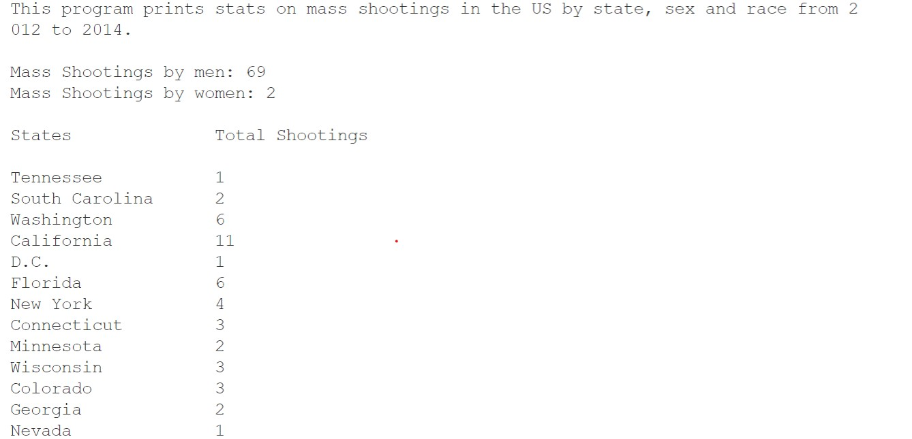

#  ***Mass Shootings 2012 to 2014***

## About 

This program from mass_shootings.csv file. Load it into the program and run data concerning Mass Shootings by  State and Mass Shootings by Race for the years beginning 2012 and ending 2014. It will then add the data to mass_shootings.json file 

### Prerequisites

Will install python3 and pip libraries that are needed.

## Example Code

        intro()

    ms_dl = open_csv_file()

    output_by_state(ms_dl)

    output_by_race(ms_dl)

    send_to_json_file(ms_dl)

## Output

Output is simple in tabular format.

...

    
### Citations:
Data csv files provided by [Data World](https://data.world/)
### Developer: Leon Boczkowski
### Email:  <lbocz02@acd.ccac.edu>