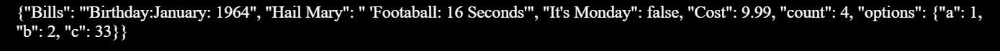

# Practice Jason

### create data structure in python that will encode/serialize into json spec
course_films  =  {}
course_films['Bills'] = "'Birthday:January: 1964"
course_films ["Hail Mary"] =" 'Football: 16 Seconds'"
course_films["It's Monday"] = False
course_films["Cost"] = 9.99
course_films["count"] = len(course_films)
course_films["options"] = {'a':1, 'b':2, 'c':33}

### writes to json files
print(json.dumps(course_films))
with open ('course_films.json', 'w') as f:
  f.write(json.dumps (course_films))

  ### output image
  

  ### link to json
[JSON](  https://www.json.org/json-en.html)