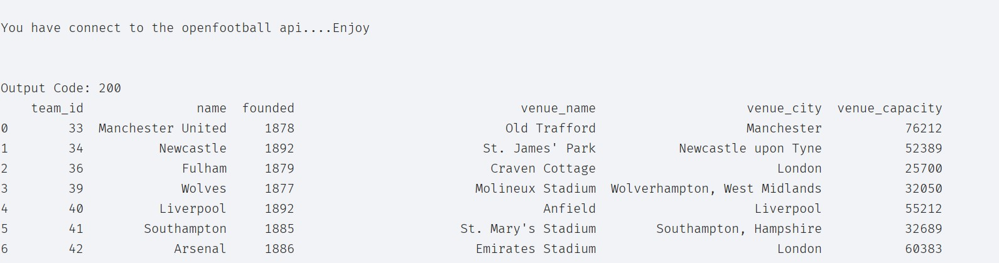

#Premeire League Football Api
***
######Prupose:  

The purpose of this script is to connect to RapidAPI API and reurn Premeire League Team data and output that data
in a user-friendly format using Pandas.  

###### Python Version and Modules:

This Script has been created using python version`Python 3.9.1
`
and uses the following Modules in order to run  

`import requests`   
`import json`  
`import  pandas as pd `  

Please check that you are running Python version compatible to use with this via cmdline using `python --version`.
Modules can be check using `pip list`. 

In order to connect with the api the following data is needed, base url for the api, endpoint for get json formatted
data as a parameter, api which is issued by vendor. 
The following data is provided by this script.  

###### Base Url:
###### the base url of the api
`base_url = "https://api-football-v1.p.rapidapi.com/v2"`

###### Endpoint:
`endpoint="/teams/league/2790`

###### Appends endpoint to base url to connect to api
    url = base_url + endpoint

###### Parameters:
The following parameters are used to connect to the English league using its timezone.    

`querystring = {"timezone": "Europe/London"}`

###### Headers:

The following headers are required for authorization

`headers = {`  
    `'x-rapidapi-key': "Enter your authorization key here",`  
    `'x-rapidapi-host': "api-football-v1.p.rapidapi.com"`  
`}`

######Status Codes:
The Api will provide you with the status codes of the connection or attempted connection to the api, using the provided
urls, headers and query strings. Using function:

`def status(http_code):`

Status codes include:

http_code == 200:

http_code == 400:

http_code == 401:

http_code == 404:

http_code == 500:

Status Code definitions can be found at:  
[Duck Duck Go](https://www.tutorialspoint.com/http/http_status_codes.htm "The best search engine for privacy").

###### Functions List:

A list of the following functions will run during the lifespan of this Python Script:  

`def main():`

main function is run on initiating Python script and contains all functions calls throughout the script lifespan.  

`def status(http_code):`  

status function will provide the http status code connection status and return stauts message.

`def teams(base_url, endpoint="/teams/league/2790"):`  

teams function is responsible for connecting with the api and pulldata down to convert to json format

`def run_as_dataframe(prem_team_l):`  

Is responsible for taking the list of dictionary data coverted to JSON readable by `teams()` converting it into a Pandas
dataframe and outputting the data in table format.

Upon succesfull connection to the api the Premeire League results should output as a Pandas table for user view.  

example results:  

  

##### Week:
7 Python 2 api's

Midterm project

#### Creator:
Leon Boczkowski

#### Contact:
lbocz@acd.ccac.edu